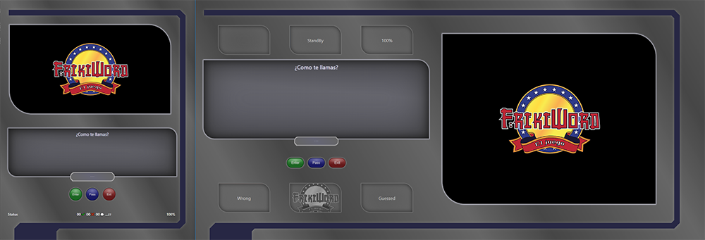
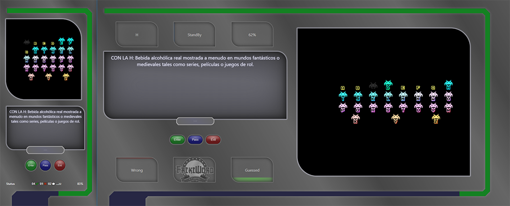
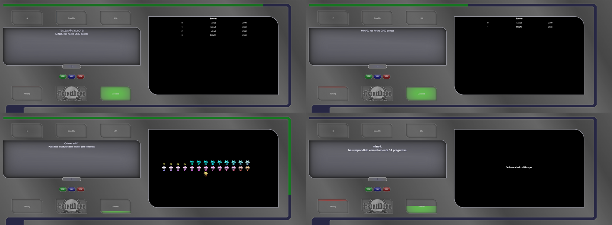

# FRIKIWORD

This is a Alphabetical or Pasapalabra game created with vanilla Javascript 5, HTML5 and pure CSS.

The game is in Spanish, it has 4 questions for each letter, chosen randomly when the game begins. These questions are "nerd questions" about videogames, comics, films and more. Game mechanics are easy, try to guess all the words before time is over, you can skip any question by doing click on "Pass" to answer it later.

## The game

To begin the game, the players can write their name, with a maximal length of 6 characters, if nothing is written, name will be "PlayerX".



In game, some window elements will change showing right, wrong or skipped answers, also will show the remaining energy/time in percentage and on an animated bar. In the desktop version we can see the current letter and the remaining questions in mobile devices.



If we press in game the exit button, it won't stop the time, we don't want to give players an extra time to think.

Game will finish if all questions have been answered or if time is over. When the time is over, a message shows how many questions have been guessed, if all questions have been answered, a message and all the scores will be showed, besides, if all questions has been guessed, an extra one will appear, saying that "You would have taken the prize pot".



## Getting Started

Copy or download this [repo](https://github.com/MinaZhen/frikiword.git)

Open your command line and enter the directory where you want to copy the repository and then enter:

```sh
git clone https://github.com/MinaZhen/frikiword.git
```

Done!

## Running the tests

For running the tests you should open SpecRunner.html

These tests are just for logic. The file that links the view with the logic (main.js) is not linked in this SpecRunner.

## Versioning

Frikiword 1.0.0

## Authors

- Marina Clarés - *web and videogames developer* - [GitHub](https://github.com/MinaZhen)

Pre-course project for: Skylab Coders Academy